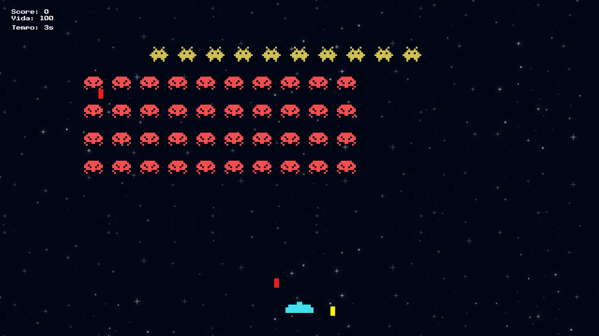

# Space Invaders

## Sobre o Projeto

A criação do game Space Invaders teve o intuito de praticar os conceitos de Programação Orientada a Objetos (POO) utilizando apenas a linguagem Java e suas bibliotecas.

## Como Executar

1. **Clone o repositório:**
2. **Navegue até o diretório do projeto:**
3. **Compile o arquivo SpaceInvaders.java**
4. **Para sair do jogo basta iniciar uma partida e apertar Esc**

## Funcionalidades

- Movimento dos personagens com as setas do teclado.
- Disparo de projéteis com a barra de espaço.
- Pontuação baseada nos inimigos abatidos.
- Níveis de dificuldade crescentes.

## Tecnologias Utilizadas

- **Java:** Linguagem de programação usada no desenvolvimento do jogo.
- **POO:** Princípios de Programação Orientada a Objetos aplicados na estrutura do projeto.

## Imagens do Jogo

## Contribuição

1. Faça um fork do projeto.
2. Crie uma nova branch para suas alterações (`git checkout -b feature/nova-funcionalidade`).
3. Faça commit das suas alterações (`git commit -m 'Adiciona nova funcionalidade'`).
4. Faça push para a branch (`git push origin feature/nova-funcionalidade`).
5. Abra um Pull Request.

